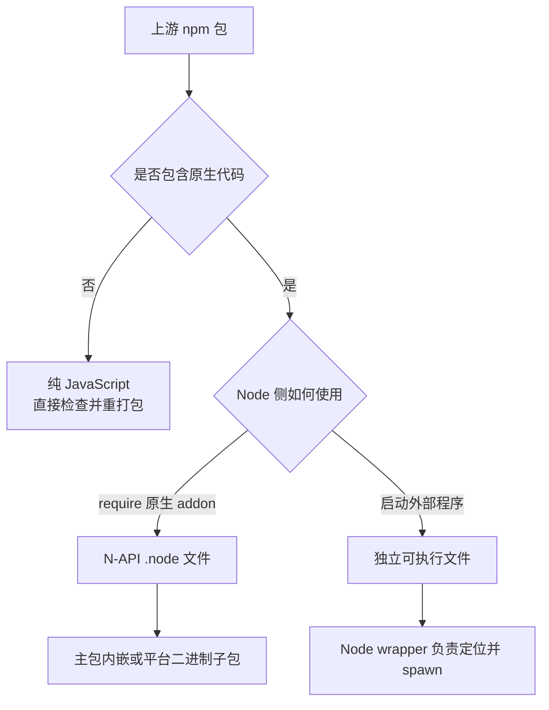
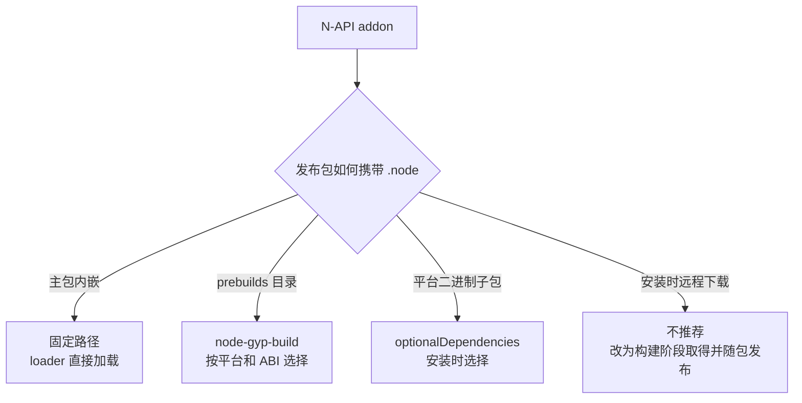
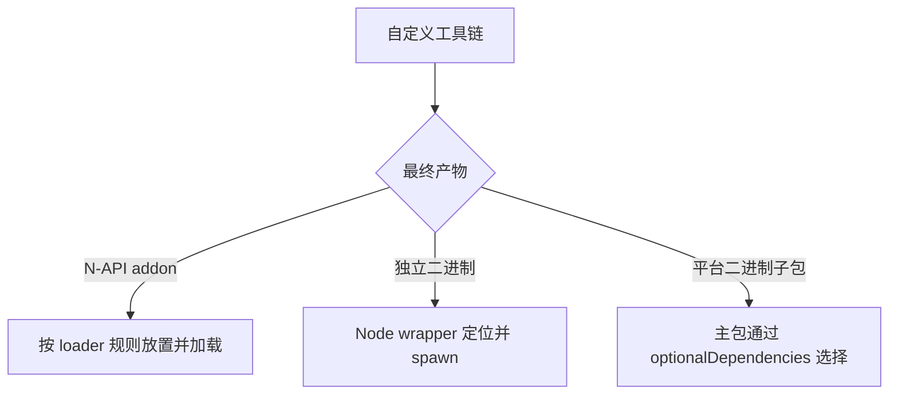

# 原生 npm 包的 port 制作方式

原生 npm 包的 port 同时涉及原生代码构建、二进制分发和运行时加载。本文说明常见产物类型、分发方式及对应的构建工具。

## 1. 最终产物



- 纯 JavaScript 包不需要原生编译，重点是确认运行时没有写死平台名称。
- N-API addon 最终必须能被 Node loader 找到并加载，不能只验证 ELF 文件存在。
- 独立可执行文件不经过 `require()` 加载，重点是架构、运行路径、权限和签名。

## 2. 二进制分发方式



### 2.1 主包内嵌

适用于 loader 已经支持固定路径，或可以通过补丁让 OpenHarmony 走固定路径的包。构建阶段编译 `.node`，签名后复制到最终发布目录，并用真实 `require()` 验证。

示例：`ports/parcel-watcher/2.5.1`。它将 OpenHarmony binding 放入上游 loader 的 fallback 路径，其他平台仍使用上游平台子包。

### 2.2 `prebuilds` + `node-gyp-build`

适用于 loader 按 `prebuilds/<platform>-<arch>/` 查找文件的包。文件名和目录必须以 loader 的实际规则为准，不能只按经验命名。

上游使用 `prebuild` + `prebuild-install` 时，通常需要在安装阶段访问 GitHub release assets。应改成 `prebuildify` + `node-gyp-build`：构建阶段编译 OpenHarmony 产物，必要时取得并校验其他平台产物，全部放入发布包；用户安装时不再依赖外部 release 下载或现场编译。

示例：`ports/sqlite3/5.1.7` 将 loader、依赖和构建脚本切换到 `node-gyp-build`/`prebuildify`，并把其他平台产物整理到同一个 `prebuilds` 目录。

如果上游本来就是 `prebuildify` + `node-gyp-build`，只需增加 OpenHarmony 目录，并确认 loader 能命中。示例：`ports/bufferutil/4.0.9`。

### 2.3 平台二进制子包

适用于上游已经按平台拆包，或主包和二进制必须独立发布的情况。主包通过 `optionalDependencies` 指向 OpenHarmony 子包，子包只包含对应平台的二进制和最小 `package.json`。

子包的名称、版本、`main` 和文件名必须与主包 loader 一致。不能只发布子包而不验证主包从干净项目安装后的加载结果。

### 2.4 安装时远程下载

不建议保留。安装阶段依赖外部 release 会增加网络失败、地区访问和供应链校验风险。若确实无法改造，应在文档中明确依赖、失败回退和支持范围，并说明为什么不能随包分发。

## 3. 构建工具

构建工具负责生成第 2 节所需的产物，分发方式由包的 loader 和 npm 包结构决定。

### 3.1 node-gyp 系

判断依据是存在 `binding.gyp`，或构建脚本明确调用 `node-gyp`。`nan`、`node-addon-api` 是 addon API 层，不改变产物的分发方式。

- 上游没有预构建分发：port 在构建阶段运行 `node-gyp rebuild`，把生成的 `.node` 放入主包或平台子包；用户安装时不再编译。
- 上游使用 `node-pre-gyp`：核对 loader 的平台标识、目录和文件名；如果安装时下载远程文件，按 2.4 的原则改为构建阶段取得并随包发布。
- 上游使用 `prebuildify` + `node-gyp-build`：按 2.2 增加 OpenHarmony 产物，沿用现有 loader。

### 3.2 napi-rs 系

根据当前 `@napi-rs/cli` 对 OpenHarmony 的支持情况选择构建命令：

- 支持 OpenHarmony：使用 `napi build --platform`，检查生成的文件名和 loader 路径。
- 不支持 OpenHarmony：使用 `cargo build --release` 生成 cdylib，再按照 loader 的命名和目录规则放置。`.so` 文件名不能直接视为正确结果，必须实际加载验证。

示例：`ports/lightningcss/1.33.0`、`ports/tailwindcss-oxide/4.3.3` 使用 napi 构建；`ports/resvg-resvg-js/2.6.2`、`ports/ast-grep-napi/0.43.0` 直接使用 cargo 构建。

### 3.3 自定义工具链



- Rust CLI 或原生库：确认依赖支持 `aarch64-unknown-linux-ohos`，处理系统调用和 vendored 依赖差异。
- Go 二进制：无 cgo 且依赖允许时可以尝试静态编译；有 cgo 或动态依赖时，必须额外处理库路径和签名。
- 无论使用哪种语言，都要验证最终包中的产物，而不是只验证构建目录中的临时文件。

示例：`ports/turbo/2.10.10`、`ports/bun-pty/0.4.10`、`ports/oxlint-tsgolint/7.0.2001`、`ports/typescript/7.0.2`。

## 4. 发布前检查

```text
源码和上游包来源固定，并有校验值
补丁确实应用，关键修改在产物中可见
package.json 的 name、version、入口和依赖正确
二进制架构正确，随包文件已签名
loader 能命中 OpenHarmony 产物
npm pack 后在干净项目中安装并真实加载
```
